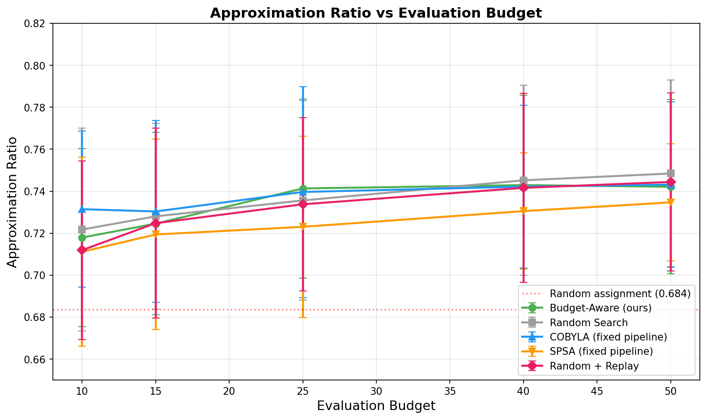

# qaoa-benchmark

A prototype study testing whether budget-aware optimization of the QAOA pipeline beats standard optimizers under noisy simulation.

## Finding

**Negative.** COBYLA with fixed p=1 defaults matched or beat the learning optimizer at most budget levels. The cost of learning pipeline variables (ansatz depth, error mitigation level, shot count) exceeded the benefit — a simple optimizer spending its entire budget on parameter search outperformed one that divides budget between pipeline configuration and parameter optimization.

## Benchmark Results

3 random graphs (10 nodes), 5 budget levels (10–50), 5 seeds per configuration, 375 total runs.

| Budget | Budget Aware | Random | COBYLA | SPSA | Random Replay |
|--------|-------------|--------|--------|------|---------------|
| 10 | 0.718 ± 0.042 | 0.722 ± 0.048 | **0.731 ± 0.037** | 0.711 ± 0.045 | 0.712 ± 0.042 |
| 15 | 0.725 ± 0.043 | 0.728 ± 0.044 | **0.730 ± 0.043** | 0.719 ± 0.045 | 0.725 ± 0.045 |
| 25 | **0.741 ± 0.043** | 0.736 ± 0.048 | 0.740 ± 0.050 | 0.723 ± 0.043 | 0.734 ± 0.041 |
| 40 | 0.743 ± 0.043 | **0.745 ± 0.045** | 0.742 ± 0.039 | 0.730 ± 0.028 | 0.742 ± 0.045 |
| 50 | 0.742 ± 0.042 | **0.748 ± 0.044** | 0.743 ± 0.039 | 0.735 ± 0.028 | 0.744 ± 0.043 |

Full results: [`results/benchmark_results.json`](results/benchmark_results.json)

## Hero Plot

## Status

This code and results are preserved as an experiment log. The study is complete and no further development is planned.
